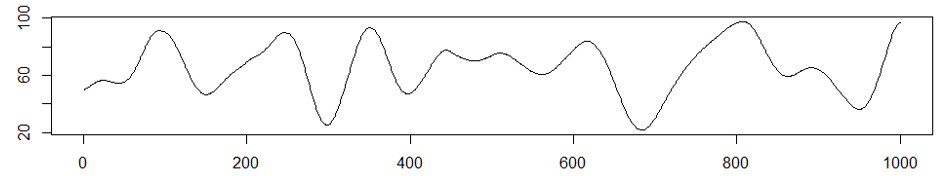

```{r setup, include=FALSE}
knitr::opts_chunk$set(echo = TRUE)
library(stringr, quietly = TRUE)
library(dplyr, quietly = TRUE)


```
## Introduction

This document was created by running the "Case_2_markdown.Rmd" file in RStudio.
It utilizes the script files "functions.R" and "rectify.R" within the "Code"
directory in this repository, which are used to define the functions that are
called below.  This document will create all of the synthetic data, fit the data
to a model, and then display the results.  Anyone interested is invited to clone
or fork the repository and change the settings for the purposes of
self-demonstration.  The verbiage here reflects the text in the paper, but in
some cases figures or examples that are present here were cut out of that
document in order to stay within a ten page limit.

## Generate the Data

The data generation script is in the file named "build_case_2_data.R".  It will
generate nine data sets: 1) dset, 2) dset_train, 3) dset_test, 4) dset_m5,
5) dset_m5_train, 6) dset_m5_test, 7) dset_m510, 8) dset_m510_train, and
9) dset_m510_test, .  The "dset" objects are consolidated data sets, and
"dset_train" and "dset_test" objects are mutually exclusive subsets of the "dset"
objects.  The "m5" and "m510" qualifiers indicate that the data is missing curve
#5 (m5 = "minus 5") or missing curves #5 and #10 (m510 = "minus 5 and 10"). This
document can be run as a notebook, block by block, or it can also be knitted
into an html document if desired.

The "relevant" data is taken from curves 5, 8, 9, 10, 13, 25, and 30.  They are
marked "RELEVANT" in the chart title.  The plots generated from the next code
block show 40 different curves, only 7 of which contain relevant data.  The
others are added to obfuscate the data and make the task of picking out the
relevant features and time steps harder.  The red markers on the curves show
the time steps for which all of the criteria for an event are met.  Each time
step generates an example which includes the data from the ten time steps before.

The data generation script will produce a plot of the entire data set for each
feature over each time step.  There are a large number of these plots, but the
process for generation and the explanation of the results is located below.

```{r generate_data, echo=FALSE}
source("build_case_2_data.R")
```

## The data generation process

The following process is common to all of the synthetic data sets.

The simulated data was generated with the following requirements in mind:

1.	The data needed to be time-varying.  Each independent variable had a
    continuous stream of data that varied over time.  This was necessary to
    generate realistic scenarios that show the potential for analyzing lagged
    longitudinal data.
2.	The data needed to be range bound.  This reflected the desire to model
    realistic physical attributes, which tend to neither rise nor fall without
    end.
3.	The data needed to be complex.  In order to provide a convincing test, it
    needed to have no easily discernable pattern.
4.	The data needed to be cyclic.  Since the idea was to simulate sensor data or
    physical processes, and enough interactions needed to be generated in order
    to create a robust data set, some sort of cyclic process was necessary.

To meet these requirements, a sine function was chosen as the basic building
block for the simulated data.  Some additional details:

1.	When necessary, the Mersenne-Twister pseudorandom algorithm was used to
    generate pseudorandom numbers.  This is the default algorithm when
    generating pseudorandom numbers via the base R package.
2.	To generate complexity, multiple sine waves of varying frequency and
    amplitude were combined via superposition.
3.	The data was generated first, and then particular data streams were chosen
    and designated as the “relevant” features.
    
The procedure (the code is in the "build_case_1_data.R" script file):

1.	Generate a large number of sine waves with five possible randomly chosen
    frequencies per cycle.  Something like this was generated:  
    
2.  Superpose several of the curves generated in step 1.  Something like the
    curve next curve was generated by this step:  
    
3.	To create a diversity of values a new range was selected using a
    pseudorandom normal distribution centered on zero, standard deviation of
    0.05, and multiplied by 100. This produced a large enough diversity of
    magnitudes to demonstrate the range agnostic quality of the method.
4.	A version of the waves was shifted by a pre-determined amount to simulate
    lag.  The next graphic shows an example of this. Using lagged data simulates
    sensor data with readings that are time-late by an unknown amount, or an
    effect that has an unknown delay time between the change in reading and the
    occurrence of an event.   
    
5.	Assemble enough curves to have a large selection of potentially “relevant”
    and non-relevant curves.  Fig. 9 shows how the relevant curves are
    interpreted to generate events.  Note that the shifted curves determine when
    the event occurs, while the unshifted curves are matched with the time step
    in which they occurred to compose the data.  
    
6.	Each time step is interpreted as a separate example, and if all relevant
    curves meet the selection criteria during that time step, it is labeled as a
    “True” example, and otherwise is labeled as “False”.  The data for each
    example is taken from the unshifted curves.
7.	The data is next flattened such that a row contains the data from the
    current time step as well as the ten time steps previous (this is adjustable
    in the script).  The data from time steps zero (the current time step)
    through nine (the data nine time steps in the past) on the row for one
    example, for instance, will be the data for time steps one through ten on
    the next chronological example.  The next graphic illustrates:
    
8.	The final step is to randomize the rows to prevent any relationship between
    time steps from influencing the final outcome of the experiment.  There is
    no indication in the flattened data features where an example belongs
    chronologically with respect to the other examples.
9.	Once the data set has been created, it is split into training and testing
    sets with 70% of the data used for training and 30% of the data used for
    testing.

The procedure described generated a data set that included several relevant
features combined via a logical AND, is representative of what might be observed
with real sensor measurements and is complex enough to prevent any latent
patterns within the data from influencing the results.  The last example will
also illustrate what happens when a logical OR is introduced.

A data set with relevant features combined via a logical OR or a combination of
logical OR and logical AND will be generated in an identical way up to step 6.
Step 6 will be modified accordingly to generate the desired relationships among
the relevant variables.

```{r load_functions, echo=FALSE}
# Loading the functions that will be used to process the data - these are
# defined in a separate script file to allow re-use between markdown documents
# as well as create a set of generalized code that might be useful to others.
source("../../Code/functions.R")
source("../../Code/rectify.R")
```

## Plot the Results

The second case is a variation on the first case, but shows the degradation of
answer fidelity when not all relevant variables are present. The following specific characteristics apply:

1.	7 relevant variables are intermixed with 33 non-relevant variables, all 7 of which must be within their relevant ranges to trigger an event.
2.	Each variable is tracked over 10 previous time-steps as well as the current time step (time step zero) and as a consequence generates 11 features per variable, for a total of 440 features per example in the flattened data.
3.	There is a single time-step/feature relevant for each variable.  As a result, the ratio of non-relevant to relevant features is approximately 63:1.  The time step features are meant to describe the delayed effect once the variable enters its critical range.
4.	There are 3437 examples in the training set, 530 of which are positive examples.
5.	There are 1474 examples in the test set, 232 of which are positive examples.  All test set examples are unseen until tested against the trained model and should be considered novel data.


```{r fit_models_m5, echo=FALSE}
message("Detecting groups...")
dstruct_m5       <- organize(dset_m5_train)
dset_m5_groups   <- dstruct_m5$groups
dstruct_m510     <- organize(dset_m510_train)
dset_m510_groups <- dstruct_m510$groups
message("  Done.")

# This code block uses a specialized routine called "modelfit" which is a
# generalized routine that fits data to a specified model type.  It was made
# to simplify the interface and make the code more succinct.
message("Fitting Models...")
# SQ means square rectified, which is a LASSO run on transformed data
model_1_m5 <- modelfit(data = dset_m5_train, fit_type = "SQ", groups = dset_m5_groups,
                       params = list(sdfilter = NULL))
# LS just means LASSO
model_2_m5 <- modelfit(data = dset_m5_train, fit_type = "LS", groups = dset_m5_groups)

model_1_m510 <- modelfit(data = dset_m510_train, fit_type = "SQ", groups = dset_m510_groups,
                params = list(sdfilter = NULL))
model_2_m510 <- modelfit(data = dset_m510_train, fit_type = "LS", groups = dset_m510_groups)
message("  Done.")
```
There is very little difference between the plots of the training and test set
performance below and those of Case I with the exception of the absent variable
#5.  The low magnitude of the coefficient was a clue that variable #5, while
relevant, was not of great importance to the final solution.  This is because
all but a handful of examples can be fully explained by the other relevant
variables.  However, if a more important relevant variable is not in the
training set, there is a considerably greater effect.  

```{r transformed_data_m5_plots, echo=FALSE}
hpos <- 0.4
message("Plotting transformed data examples...")
plot(model_1_m5, title = "Case #2 (minus curve #5) Training Set", h=.5, cx = hpos,
     ylab = "Predicted Probability")
plot(model_1_m5, title = "Case #2 (minus curve #5) Test Set", data = dset_m5_test,
     ylab = "Predicted Probability", h=.5, cx = hpos)
message("  Done.")
```

```{r untransformed_data_m5_plots, echo=FALSE}
message("Plotting un-transformed data examples...")
plot(model_2_m5, title = "Case #2 Training Set (no transform, minus #5)", h=.5,
     ylab = "Predicted Probability", cx = hpos)
plot(model_2_m5, title = "Case #2 Test Set (no transform, minus #5)",
     ylab = "Predicted Probability", data = dset_test, h=.5, cx = hpos)
message("  Done.")
```

Using the same data set as the previous case, but with relevant variable #5
deleted from the data set before training yields the coefficient bar plot below.

```{r transformed_data_m5_barplot, echo=FALSE}
TRANS   <- 0.2
BARHT   <- 7.5
beta1   <- model_1_m5$model$beta[,]
markers <- rep(0,length(beta1))
cols    <- rep(rgb(0,0,0,0), length(beta1))

cols[grep("V8TM10", names(beta1))]     <- rgb(0.5, 0.0, 0.5,TRANS) #PURPLE
markers[grep("V8TM10", names(beta1))]  <- BARHT
cols[grep("V9TM1$", names(beta1))]      <- rgb(0.0, 1.0, 0.0,TRANS) #GREEN
markers[grep("V9TM1$", names(beta1))]   <- BARHT
cols[grep("V10TM0", names(beta1))]     <- rgb(1.0, 0.5, 0.0,TRANS) #ORANGE
markers[grep("V10TM0", names(beta1))]  <- BARHT
cols[grep("V13TM2", names(beta1))]     <- rgb(1.0, 0.0, 1.0,TRANS) #MAGENTA
markers[grep("V13TM2", names(beta1))]  <- BARHT
cols[grep("V25TM3", names(beta1))]     <- rgb(0.1, 0.5, 0.5,TRANS) #TEAL
markers[grep("V25TM3", names(beta1))]  <- BARHT
cols[grep("V30TM7", names(beta1))]     <- rgb(0.1, 0.1, 0.0,TRANS) #DARK BROWN
markers[grep("V30TM7", names(beta1))]  <- BARHT

par(new=FALSE, mar = c(6,3,3,2))
barplot(beta1, border = "blue", col = "blue", ylim = c(-0.5, BARHT), las = 2,
        xaxt = "n")

par(new=TRUE)
bplot <- barplot(markers, border = cols, col = cols, ylim = c(-0.5, BARHT),
                 yaxt = "n", main = "Coefficient Magnitudes for Transformed Data Fit (minus #5)")
cnames <- c("V8TM10", "V9TM1", "V10TM0", "V13TM2", "V25TM3", "V30TM7")
bplot_at <- NULL
for (i in 1:length(cnames))
  bplot_at <- c(bplot_at,grep(paste0(cnames[i],"$"),names(beta1)))
bplot_labels <- rep(NA, length(beta1))
bplot_labels[bplot_at] <- cnames
axis(1, at = bplot, labels =bplot_labels, las=2, cex.axis=0.7, tick=FALSE)
```

```{r untransformed_data_m5_barplot, echo=FALSE}
BARHT   <- 20
beta2   <- model_2_m5$model$beta[,]
markers <- rep(0,length(beta2))
cols    <- rep(rgb(0,0,0,0), length(beta2))
  
cols[grep("V8TM10", names(beta2))]     <- rgb(0.5, 0.0, 0.5,TRANS) #PURPLE
markers[grep("V8TM10", names(beta2))]  <- BARHT
cols[grep("V9TM1$", names(beta2))]      <- rgb(0.0, 1.0, 0.0,TRANS) #GREEN
markers[grep("V9TM1$", names(beta2))]   <- BARHT
cols[grep("V10TM0", names(beta2))]     <- rgb(1.0, 0.5, 0.0,TRANS) #ORANGE
markers[grep("V10TM0", names(beta2))]  <- BARHT
cols[grep("V13TM2", names(beta2))]     <- rgb(1.0, 0.0, 1.0,TRANS) #MAGENTA
markers[grep("V13TM2", names(beta2))]  <- BARHT
cols[grep("V25TM3", names(beta2))]     <- rgb(0.1, 0.5, 0.5,TRANS) #TEAL
markers[grep("V25TM3", names(beta2))]  <- BARHT
cols[grep("V30TM7", names(beta2))]     <- rgb(0.1, 0.1, 0.0,TRANS) #DARK BROWN
markers[grep("V30TM7", names(beta2))]  <- BARHT
  
par(new=FALSE, mar = c(6,3,3,2))
barplot(beta2, border = "blue", col = "blue", ylim = c(-BARHT, BARHT), las = 2,
        xaxt = "n")

par(new=TRUE)
bplot <- barplot(markers, border = cols, col = cols, ylim = c(-0.5, BARHT),
                 yaxt = "n", main = "Coefficient Magnitudes for Un-Transformed Data Fit (minus #5)")
cnames <- c("V8TM10", "V9TM1", "V10TM0", "V13TM2", "V25TM3", "V30TM7")
bplot_at <- NULL
for (i in 1:length(cnames))
  bplot_at <- c(bplot_at,grep(paste0(cnames[i],"$"),names(beta1)))
bplot_labels <- rep(NA, length(beta1))
bplot_labels[bplot_at] <- cnames
axis(1, at = bplot, labels =bplot_labels, las=2, cex.axis=0.7, tick=FALSE)
```

With both variable #5 and variable #10 missing, the plots below show that the
performance suffers and that the coefficients are far less clear about which
variables and time steps are the most relevant.  

```{r transformed_data_m510_plots, echo=FALSE}
hpos <- 0.4
message("Plotting transformed data examples...")
plot(model_1_m510, title = "Case #2 (minus curve #5/10) Training Set", h=.5,
     ylab = "Predicted Probability", cx = hpos)
plot(model_1_m510, title = "Case #2 (minus curve #5/10) Test Set",
     ylab = "Predicted Probability", data = dset_m510_test, h=.5, cx = hpos)
message("  Done.")
```

With both variable #5 and variable #10 missing, the plots below show that the
performance suffers and that the coefficients are far less clear about which
variables and time steps are the most relevant. 

```{r untransformed_data_m510_plots, echo=FALSE}
message("Plotting un-transformed data examples...")
plot(model_2_m510, title = "Case #2 Training Set (no transform, minus #5/10)", h=.5,
     ylab = "Predicted Probability", cx = hpos)
plot(model_2_m510, title = "Case #2 Test Set (no transform, minus #5/10)",
     ylab = "Predicted Probability", data = dset_test, h=.5, cx = hpos)
message("  Done.")
```

The coefficients when there is data missing are far less sparse and not nearly
as interpretable as the case I plots, but it does show that the correct
variables and time steps were still captured, even if they did not stand out
from all the other spurious returns on non-relevant variables by virtue of
coefficient size.  Because of this, the model which used the transformed data
still outperforms the one that was fitted with the original continuous data
by a large margin.

```{r transformed_data_m510_barplot, echo=FALSE}
TRANS   <- 0.2
BARHT   <- 7.5
beta1   <- model_1_m510$model$beta[,]
markers <- rep(0,length(beta1))
cols    <- rep(rgb(0,0,0,0), length(beta1))

cols[grep("V8TM10$", names(beta1))]     <- rgb(0.5, 0.0, 0.5,TRANS) #PURPLE
markers[grep("V8TM10$", names(beta1))]  <- BARHT
cols[grep("V9TM1$", names(beta1))]      <- rgb(0.0, 1.0, 0.0,TRANS) #GREEN
markers[grep("V9TM1$", names(beta1))]   <- BARHT
cols[grep("V13TM2$", names(beta1))]     <- rgb(1.0, 0.0, 1.0,TRANS) #MAGENTA
markers[grep("V13TM2$", names(beta1))]  <- BARHT
cols[grep("V25TM3$", names(beta1))]     <- rgb(0.1, 0.5, 0.5,TRANS) #TEAL
markers[grep("V25TM3$", names(beta1))]  <- BARHT
cols[grep("V30TM7$", names(beta1))]     <- rgb(0.1, 0.1, 0.0,TRANS) #DARK BROWN
markers[grep("V30TM7$", names(beta1))]  <- BARHT

par(new=FALSE, mar = c(6,3,3,2))
barplot(beta1, border = "blue", col = "blue", ylim = c(-0.5, BARHT), las = 2,
        xaxt = "n")

par(new=TRUE)
bplot <- barplot(markers, border = cols, col = cols, ylim = c(-0.5, BARHT),
                 yaxt = "n", main = "Coefficient Magnitudes for Transformed Data Fit (minus #5/10)")
cnames <- c("V8TM10", "V9TM1", "V13TM2", "V25TM3", "V30TM7")
bplot_at <- NULL
for (i in 1:length(cnames))
  bplot_at <- c(bplot_at,grep(paste0(cnames[i],"$"),names(beta1)))
bplot_labels <- rep(NA, length(beta1))
bplot_labels[bplot_at] <- cnames
axis(1, at = bplot, labels =bplot_labels, las=2, cex.axis=0.7, tick=FALSE)
```

```{r untransformed_data_m510_barplot, echo=FALSE}
BARHT   <- 20
beta2   <- model_2_m510$model$beta[,]
markers <- rep(0,length(beta2))
cols    <- rep(rgb(0,0,0,0), length(beta2))
  
cols[grep("V8TM10", names(beta2))]     <- rgb(0.5, 0.0, 0.5,TRANS) #PURPLE
markers[grep("V8TM10", names(beta2))]  <- BARHT
cols[grep("V9TM1$", names(beta2))]      <- rgb(0.0, 1.0, 0.0,TRANS) #GREEN
markers[grep("V9TM1$", names(beta2))]   <- BARHT
cols[grep("V13TM2", names(beta2))]     <- rgb(1.0, 0.0, 1.0,TRANS) #MAGENTA
markers[grep("V13TM2", names(beta2))]  <- BARHT
cols[grep("V25TM3", names(beta2))]     <- rgb(0.1, 0.5, 0.5,TRANS) #TEAL
markers[grep("V25TM3", names(beta2))]  <- BARHT
cols[grep("V30TM7", names(beta2))]     <- rgb(0.1, 0.1, 0.0,TRANS) #DARK BROWN
markers[grep("V30TM7", names(beta2))]  <- BARHT
  
par(new=FALSE, mar = c(6,3,3,2))
barplot(beta2, border = "blue", col = "blue", ylim = c(-BARHT, BARHT), las = 2,
        xaxt = "n")

par(new=TRUE)
bplot <- barplot(markers, border = cols, col = cols, ylim = c(-0.5, BARHT),
                 yaxt = "n", main = "Coefficient Magnitudes for Un-Transformed Data Fit (minus #5/10)")
cnames <- c("V8TM10", "V9TM1", "V13TM2", "V25TM3", "V30TM7")
bplot_at <- NULL
for (i in 1:length(cnames))
  bplot_at <- c(bplot_at,grep(paste0(cnames[i],"$"),names(beta1)))
bplot_labels <- rep(NA, length(beta1))
bplot_labels[bplot_at] <- cnames
axis(1, at = bplot, labels =bplot_labels, las=2, cex.axis=0.7, tick=FALSE)
```

The more missing data there is, the greater the level of noise in the final
result.  While this is inconvenient, it is also a reliable indicator regarding
whether there might be an under- or un-represented causative factor in the data,
perhaps leading an investigator to continue searching for new features to
achieve a sparse return similar to Fig. 13.