## Introduction

This document was created by running the "Case_3_markdown.Rmd" file in RStudio.
It utilizes the script files "functions.R", "rectify.R", and "collapse_limits.R",
within the "Code" directory in this repository, which are used to define the
functions that are called below.  This document will create all of the synthetic
data, fit the data to a model, and then display the results.  Anyone interested
is invited to clone or fork the repository and change the settings for the
purposes of self-demonstration. The verbiage here reflects the text in the
paper, but in some cases figures or examples that are present here were cut out
of that document in order to stay within a ten page limit.

## Generate the Data

The data generation script is in the file named "build_case_3_data.R".  It will
generate three data sets: 1) dset, 2) dset_train, and 3) dset_test.  The "dset" 
object is a consolidated data set, while the "dset_train" and "dset_test"
objects are mutually exclusive subsets of "dset".  This document can be run as a notebook, block by block, or it can also be knitted into an html document if
desired.

The "relevant" data is taken from curves 1, 2, 4, and 5.  They are marked
"RELEVANT" in the chart title.  The plots generated from the next code block
show 5 different curves, only 4 of which contain relevant data.  The other is
added to obfuscate the data and make the task of picking out the relevant
features and time steps somewhat harder, but the total number of curves is kept
low in this example in order to make the process more clear.  The next case is
similar, but adds a significant number of non-relevant curves.  The red markers
on the curves show the time steps for which all of the criteria for an event are
met.  Each time step generates an example which includes the data from the ten
time steps before.

The data generation script will produce a plot of the entire data set for each
feature over each time step.  There are a large number of these plots, but the
process for generation and the explanation of the results is located below.
Note again that there are only five curves for this case in order to provide a
simpler problem.  To change this, edit the "build_case_3_data.R" file. In order
for this markdown to work correctly as written, the relevant curves would need
to remain the same, but as many non-relevant curves as is desired can be added
in without changing the details of the code.

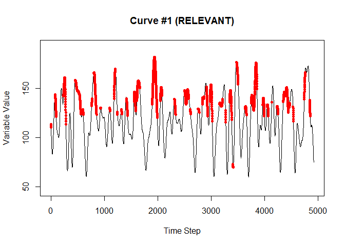<!-- -->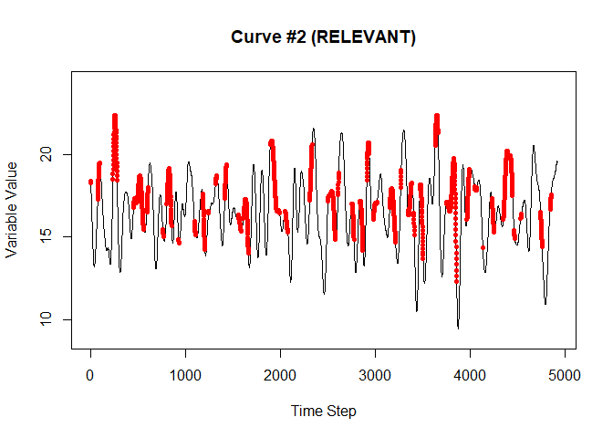<!-- -->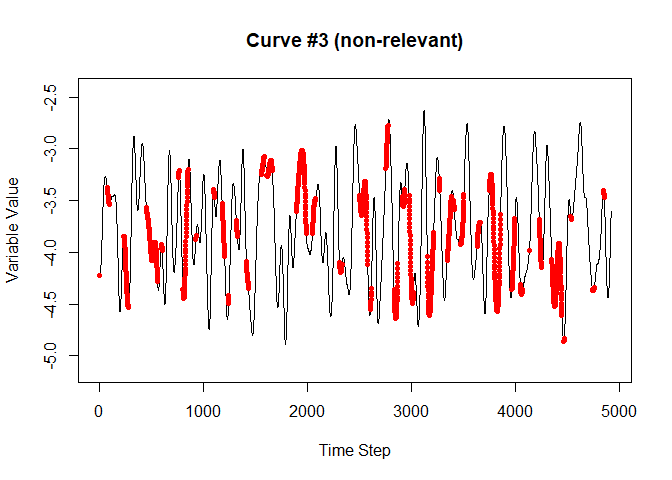<!-- -->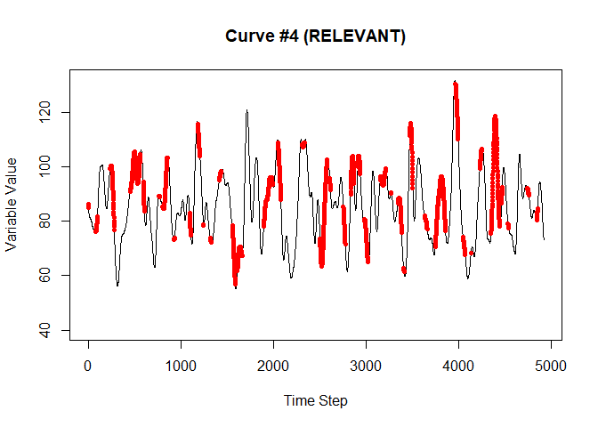<!-- -->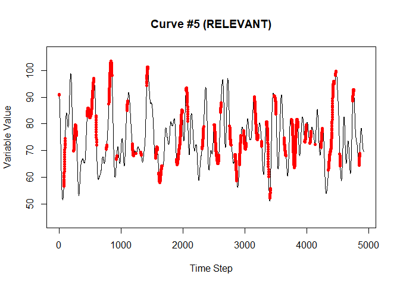<!-- -->

## The data generation process

The following process is common to all of the synthetic data sets.

The simulated data was generated with the following requirements in mind:

1.	The data needed to be time-varying.  Each independent variable had a
    continuous stream of data that varied over time.  This was necessary to
    generate realistic scenarios that show the potential for analyzing lagged
    longitudinal data.
2.	The data needed to be range bound.  This reflected the desire to model
    realistic physical attributes, which tend to neither rise nor fall without
    end.
3.	The data needed to be complex.  In order to provide a convincing test, it
    needed to have no easily discernable pattern.
4.	The data needed to be cyclic.  Since the idea was to simulate sensor data or
    physical processes, and enough interactions needed to be generated in order
    to create a robust data set, some sort of cyclic process was necessary.

To meet these requirements, a sine function was chosen as the basic building
block for the simulated data.  Some additional details:

1.	When necessary, the Mersenne-Twister pseudorandom algorithm was used to
    generate pseudorandom numbers.  This is the default algorithm when
    generating pseudorandom numbers via the base R package.
2.	To generate complexity, multiple sine waves of varying frequency and
    amplitude were combined via superposition.
3.	The data was generated first, and then particular data streams were chosen
    and designated as the “relevant” features.
    
The procedure (the code is in the "build_case_1_data.R" script file):

1.	Generate a large number of sine waves with five possible randomly chosen
    frequencies per cycle.  Something like this was generated:  
    
2.  Superpose several of the curves generated in step 1.  Something like the
    curve next curve was generated by this step:  
    
3.	To create a diversity of values a new range was selected using a
    pseudorandom normal distribution centered on zero, standard deviation of
    0.05, and multiplied by 100. This produced a large enough diversity of
    magnitudes to demonstrate the range agnostic quality of the method.
4.	A version of the waves was shifted by a pre-determined amount to simulate
    lag.  The next graphic shows an example of this. Using lagged data simulates
    sensor data with readings that are time-late by an unknown amount, or an
    effect that has an unknown delay time between the change in reading and the
    occurrence of an event.   
    
5.	Assemble enough curves to have a large selection of potentially “relevant”
    and non-relevant curves.  Fig. 9 shows how the relevant curves are
    interpreted to generate events.  Note that the shifted curves determine when
    the event occurs, while the unshifted curves are matched with the time step
    in which they occurred to compose the data.  
    
6.	Each time step is interpreted as a separate example, and if all relevant
    curves meet the selection criteria during that time step, it is labeled as a
    “True” example, and otherwise is labeled as “False”.  The data for each
    example is taken from the unshifted curves.
7.	The data is next flattened such that a row contains the data from the
    current time step as well as the ten time steps previous (this is adjustable
    in the script).  The data from time steps zero (the current time step)
    through nine (the data nine time steps in the past) on the row for one
    example, for instance, will be the data for time steps one through ten on
    the next chronological example.  The next graphic illustrates:
    
8.	The final step is to randomize the rows to prevent any relationship between
    time steps from influencing the final outcome of the experiment.  There is
    no indication in the flattened data features where an example belongs
    chronologically with respect to the other examples.
9.	Once the data set has been created, it is split into training and testing
    sets with 70% of the data used for training and 30% of the data used for
    testing.

The procedure described generated a data set that included several relevant
features combined via a logical AND, is representative of what might be observed
with real sensor measurements and is complex enough to prevent any latent
patterns within the data from influencing the results.  The last example will
also illustrate what happens when a logical OR is introduced.

A data set with relevant features combined via a logical OR or a combination of
logical OR and logical AND will be generated in an identical way up to step 6.
Step 6 will be modified accordingly to generate the desired relationships among
the relevant variables.


## Plot the Results

The third case introduces a logical OR relationship between four variables of the form:

<h5 align="center"><i>AB + CD = Z</i></h5>

There are two variables in a logical AND relationship on either side of a
logical OR operator.  For the reasons explained previously, this situation poses
a challenge to this method because the way that the apparent critical ranges are
determined ensures that a logical AND and a logical OR relationship appear
identical.  If a logical OR relationship exists, the training set exhibits the
distinctive pattern shown in the following plots.


```
## Detecting groups...
```

```
##   Done.
```

```
## Fitting Models...
```

```
## Fitting initial models...
```

```
## Warning: package 'rlang' was built under R version 4.2.1
```

```
## Loaded glmnet 4.1-4
```

```
## Loading required package: openssl
```

```
## Warning: package 'openssl' was built under R version 4.2.1
```

```
## Linking to: OpenSSL 1.1.1k  25 Mar 2021
```

```
##   Done.
```

The perfect classification of the positive examples and poor classification
performance of the negative examples in both the training and test set is a
distinctive relationship that occurs often when there is a logical 'OR'
relationship present.  Once this is known, steps can be taken to make the
additional computational investment of creating the different versions of the
features that might exist with different critical ranges and then fitting the
new larger (about 2 x size) data set.  


```
## Plotting transformed data examples...
```

```
## 
## Attaching package: 'gridExtra'
```

```
## The following object is masked from 'package:dplyr':
## 
##     combine
```

<!-- --><!-- -->

```
##   Done.
```

Without calculating the extra versions, the un-transformed data actually
outperforms the transformed data.


```
## Plotting un-transformed data examples...
```

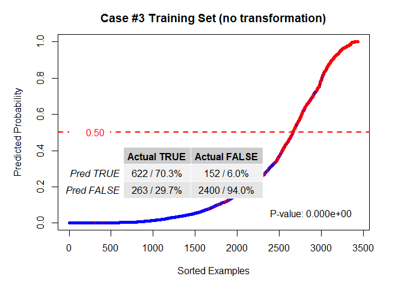<!-- -->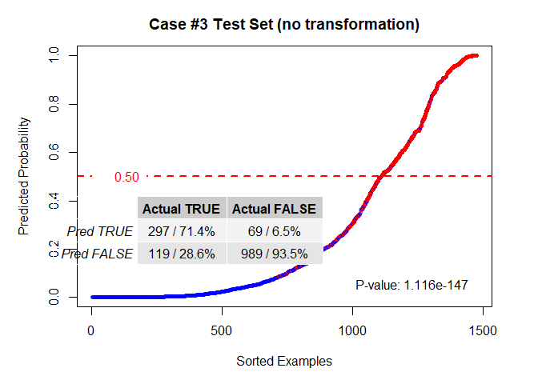<!-- -->

```
##   Done.
```

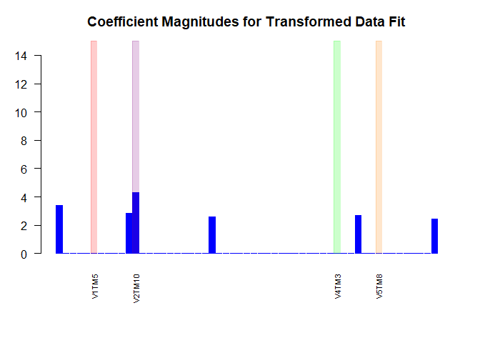<!-- -->

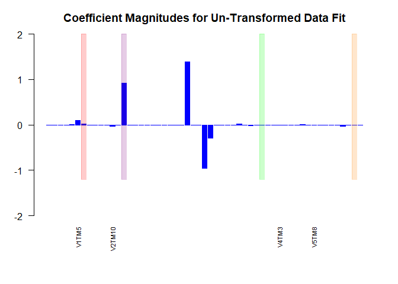<!-- -->

The computational advantage slightly reduced when the extra versions are
calculated because the size of the new data set is essentially double that of
the old one. However, the increase in performance in terms of the accuracy of
the model when compared to the non-transformed data is arguably worth expending
the small amount of extra computational energy to produce the much better
results. The next plots show the success of the fit against the test set with
the extra versions calculated.


```
## Fitting a new model with additional feature versions that *might* exist...
```

```
##   Done.
```

It is clear from the performance of the new models trained with extra versions
of each feature that would exist if a logical 'OR' relationship existed that
there is a significant performance boost when the new versions of each feature
with different critical ranges are created. The Figures below show the training
and test sets when applied to the model created with the limited number of extra
versions, and the performance advantage over the LASSO applied to the original
continuous data is profound.

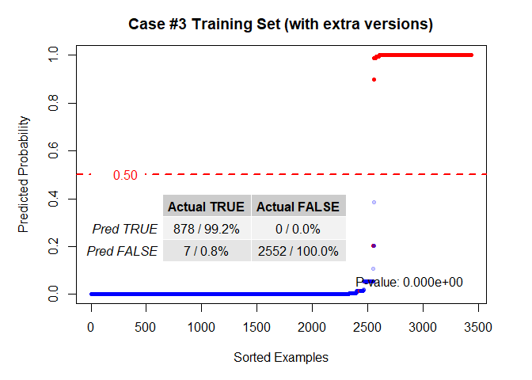<!-- -->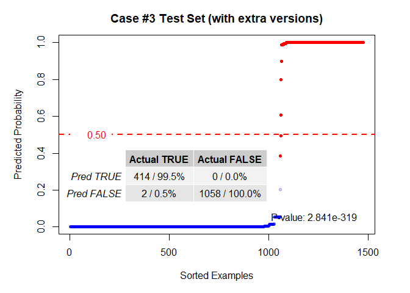<!-- -->

The LASSO results with the unmodified continuous data shown above indicate that
while there is definitely a relationship, the difficulty in creating a model in
which multiple features within the same data set can independently cause the
same result is evident. 

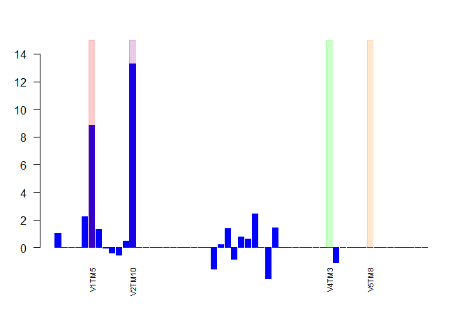<!-- -->

The previous plot shows that two out of the four relevant curves are adequately
identified as having nonzero coefficients that stand out.  The reason that only
two are identified is that in this case, the the results can be completely
described by those two features alone.  They occlude the other features, since
there are no examples in which the remaining features are needed to explain.  It
is notable that even though the remaining features are occluded by the first
two, they still introduced a great deal of error in the standard LASSO, as well
as the LASSO on the modified data without the extra versions of the features.
