## Introduction

This document was created by running the "Case_4_markdown.Rmd" file in RStudio.
It utilizes the script files "functions.R", "rectify.R", and "collapse_limits.R",
within the "Code" directory in this repository, which are used to define the
functions that are called below.  This document will create all of the synthetic
data, fit the data to a model, and then display the results.  Anyone interested
is invited to clone or fork the repository and change the settings for the
purposes of self-demonstration. The verbiage here reflects the text in the
paper, but in some cases figures or examples that are present here were cut out
of that document in order to stay within a ten page limit.

## Generate the Data

The data generation script is in the file named "build_case_4_data.R".  It will
generate three data sets: 1) dset, 2) dset_train, and 3) dset_test.  The "dset"
object is a consolidated data set, while "dset_train" and "dset_test" objects
are mutually exclusive subsets of "dset".  This document can be run as a
notebook, block by block, or it can also be knitted into an html document if
desired.

The "relevant" data is taken from curves 1, 2, 4, and 5.  They are marked
"RELEVANT" in the chart title.  The plots generated from the next code block
show 15 different curves, only 4 of which contain relevant data.  The others are
added to obfuscate the data and make the task of picking out the relevant
features and time steps somewhat harder.  The red markers on the curves show the
time steps for which all of the criteria for an event are met.  Each time step
generates an example which includes the data from the ten time steps before.

The data generation script will produce a plot of the entire data set for each
feature over each time step.  There are a large number of these plots, but the
process for generation and the explanation of the results is located below. To
change this, edit the "build_case_4_data.R" file. In order for this markdown to
work correctly as written, the relevant curves would need to remain the same,
but as many non-relevant curves as is desired can be added or subtracted without changing the details of the code.

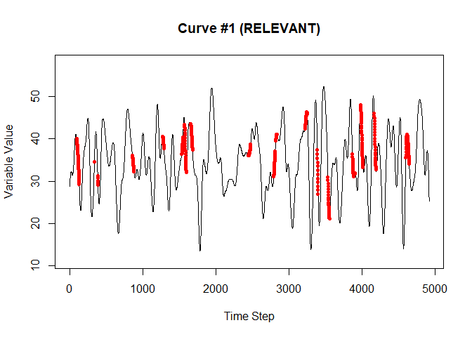<!-- -->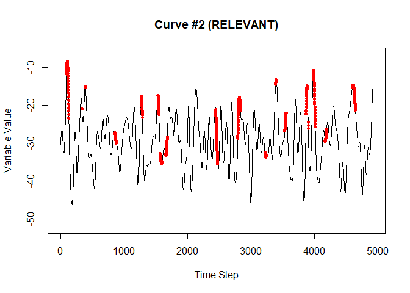<!-- -->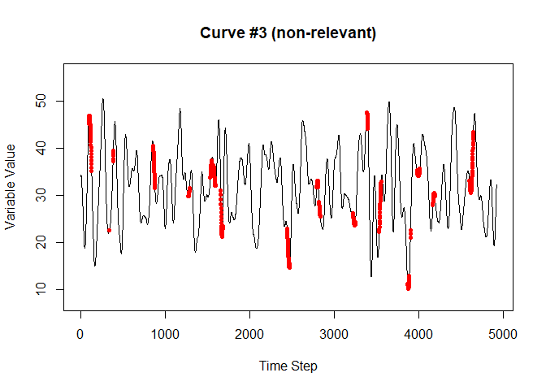<!-- -->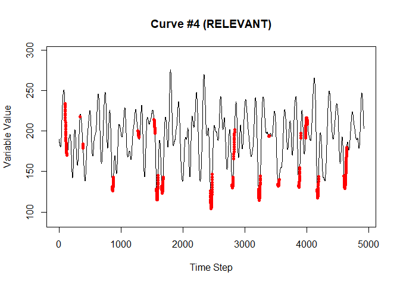<!-- -->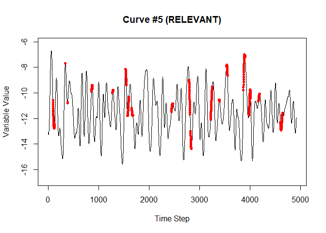<!-- -->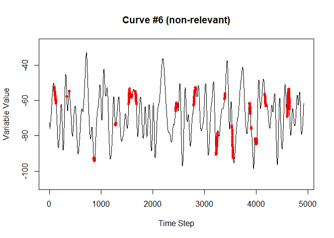<!-- -->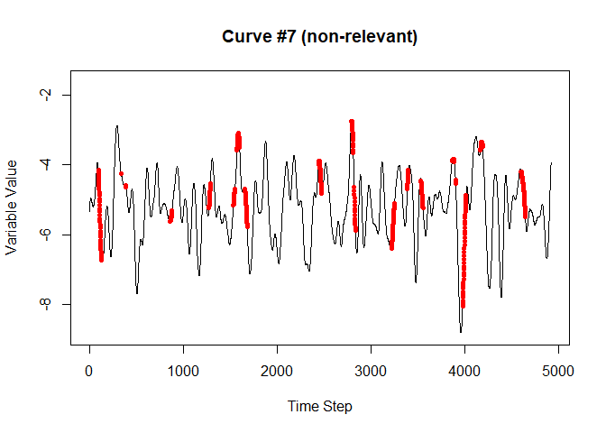<!-- -->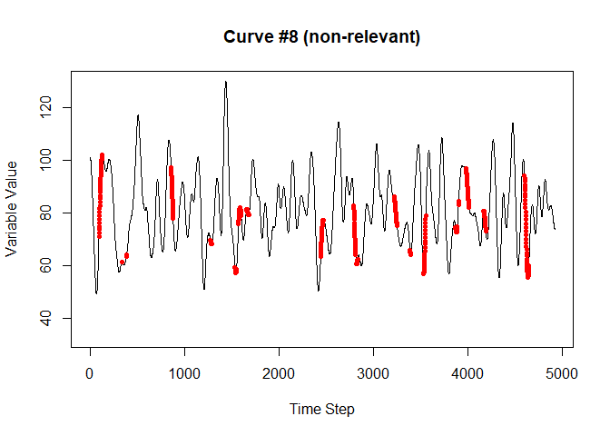<!-- -->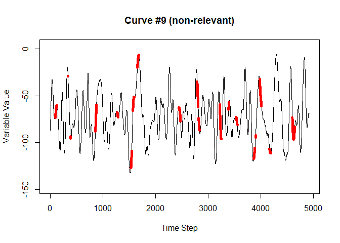<!-- -->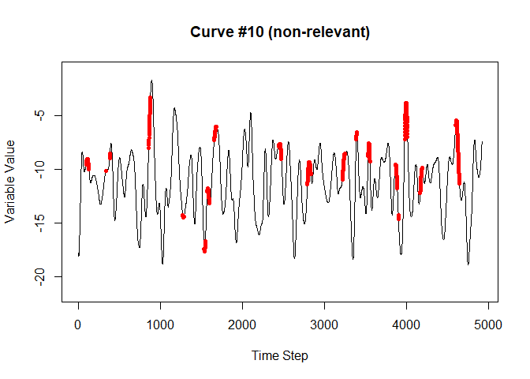<!-- -->

## The data generation process

The following process is common to all of the synthetic data sets.

The simulated data was generated with the following requirements in mind:

1.	The data needed to be time-varying.  Each independent variable had a
    continuous stream of data that varied over time.  This was necessary to
    generate realistic scenarios that show the potential for analyzing lagged
    longitudinal data.
2.	The data needed to be range bound.  This reflected the desire to model
    realistic physical attributes, which tend to neither rise nor fall without
    end.
3.	The data needed to be complex.  In order to provide a convincing test, it
    needed to have no easily discernable pattern.
4.	The data needed to be cyclic.  Since the idea was to simulate sensor data or
    physical processes, and enough interactions needed to be generated in order
    to create a robust data set, some sort of cyclic process was necessary.

To meet these requirements, a sine function was chosen as the basic building
block for the simulated data.  Some additional details:

1.	When necessary, the Mersenne-Twister pseudorandom algorithm was used to
    generate pseudorandom numbers.  This is the default algorithm when
    generating pseudorandom numbers via the base R package.
2.	To generate complexity, multiple sine waves of varying frequency and
    amplitude were combined via superposition.
3.	The data was generated first, and then particular data streams were chosen
    and designated as the “relevant” features.
    
The procedure (the code is in the "build_case_1_data.R" script file):

1.	Generate a large number of sine waves with five possible randomly chosen
    frequencies per cycle.  Something like this was generated:  
    
2.  Superpose several of the curves generated in step 1.  Something like the
    curve next curve was generated by this step:  
    
3.	To create a diversity of values a new range was selected using a
    pseudorandom normal distribution centered on zero, standard deviation of
    0.05, and multiplied by 100. This produced a large enough diversity of
    magnitudes to demonstrate the range agnostic quality of the method.
4.	A version of the waves was shifted by a pre-determined amount to simulate
    lag.  The next graphic shows an example of this. Using lagged data simulates
    sensor data with readings that are time-late by an unknown amount, or an
    effect that has an unknown delay time between the change in reading and the
    occurrence of an event.   
    
5.	Assemble enough curves to have a large selection of potentially “relevant”
    and non-relevant curves.  Fig. 9 shows how the relevant curves are
    interpreted to generate events.  Note that the shifted curves determine when
    the event occurs, while the unshifted curves are matched with the time step
    in which they occurred to compose the data.  
    
6.	Each time step is interpreted as a separate example, and if all relevant
    curves meet the selection criteria during that time step, it is labeled as a
    “True” example, and otherwise is labeled as “False”.  The data for each
    example is taken from the unshifted curves.
7.	The data is next flattened such that a row contains the data from the
    current time step as well as the ten time steps previous (this is adjustable
    in the script).  The data from time steps zero (the current time step)
    through nine (the data nine time steps in the past) on the row for one
    example, for instance, will be the data for time steps one through ten on
    the next chronological example.  The next graphic illustrates:
    
8.	The final step is to randomize the rows to prevent any relationship between
    time steps from influencing the final outcome of the experiment.  There is
    no indication in the flattened data features where an example belongs
    chronologically with respect to the other examples.
9.	Once the data set has been created, it is split into training and testing
    sets with 70% of the data used for training and 30% of the data used for
    testing.

The procedure described generated a data set that included several relevant
features combined via a logical AND, is representative of what might be observed
with real sensor measurements and is complex enough to prevent any latent
patterns within the data from influencing the results.  The last example will
also illustrate what happens when a logical OR is introduced.

A data set with relevant features combined via a logical OR or a combination of
logical OR and logical AND will be generated in an identical way up to step 6.
Step 6 will be modified accordingly to generate the desired relationships among
the relevant variables.


## Plot the Results

The fourth case uses a logical OR relationship similar to case 3 between four variables of the form:

<h5 align="center"><i>AB + CD = Z</i></h5>

There are two variables in a logical AND relationship on either side of a
logical OR operator.  For the reasons explained previously, this situation poses
a challenge to this method because the way that the apparent critical ranges are
determined ensures that a logical AND and a logical OR relationship appear
identical.  If a logical OR relationship exists, the training set exhibits the
distinctive pattern shown in the following plots.


```
## Detecting groups...
```

```
##   Done.
```

```
## Fitting Models...
```

```
## Fitting initial models...
```

```
## Loading required package: rlang
```

```
## Warning: package 'rlang' was built under R version 4.2.1
```

```
## Loading required package: gglasso
```

```
## Warning: package 'gglasso' was built under R version 4.2.1
```

```
## Loading required package: randomForest
```

```
## Warning: package 'randomForest' was built under R version 4.2.1
```

```
## randomForest 4.7-1.1
```

```
## Type rfNews() to see new features/changes/bug fixes.
```

```
## 
## Attaching package: 'randomForest'
```

```
## The following object is masked from 'package:dplyr':
## 
##     combine
```

```
## Loading required package: openssl
```

```
## Warning: package 'openssl' was built under R version 4.2.1
```

```
## Linking to: OpenSSL 1.1.1k  25 Mar 2021
```

```
##   Done.
```

The perfect classification of the positive examples and poor classification
performance of the negative examples in the training and near perfect
classification for othe test set is a distinctive relationship that occurs often
when there is a logical 'OR' relationship present.  Once this is known or
suspected, steps can be taken to make the additional computational investment of
creating additional versions of the features that might exist with different
critical ranges and then fitting the new larger (sized two times plus) data set.  


```
## Plotting transformed data examples...
```

```
## Loaded glmnet 4.1-4
```

```
## 
## Attaching package: 'gridExtra'
```

```
## The following object is masked from 'package:randomForest':
## 
##     combine
```

```
## The following object is masked from 'package:dplyr':
## 
##     combine
```

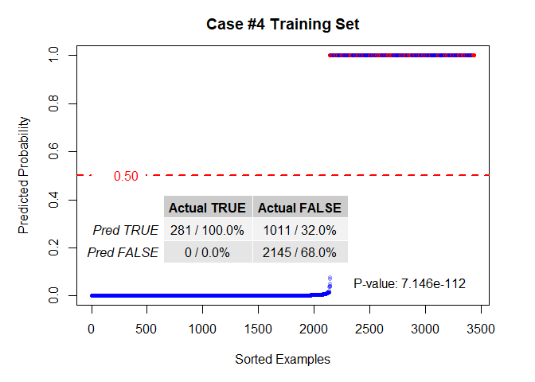<!-- -->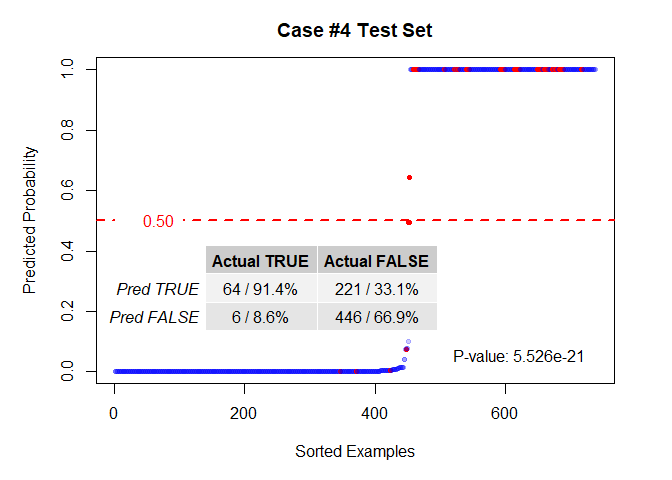<!-- -->

```
##   Done.
```

Without calculating the extra versions, the un-transformed data actually
outperforms the transformed data, but not by much.


```
## Plotting un-transformed data examples...
```

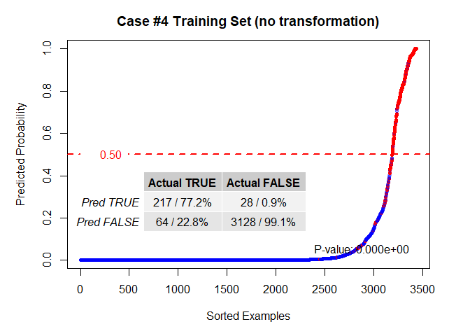<!-- -->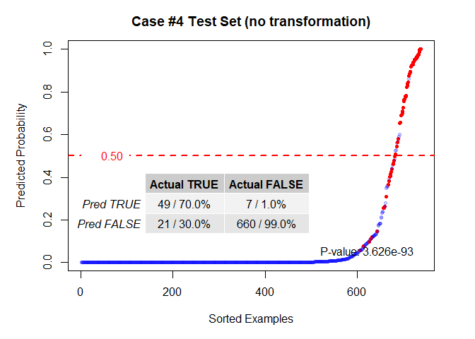<!-- -->

```
##   Done.
```

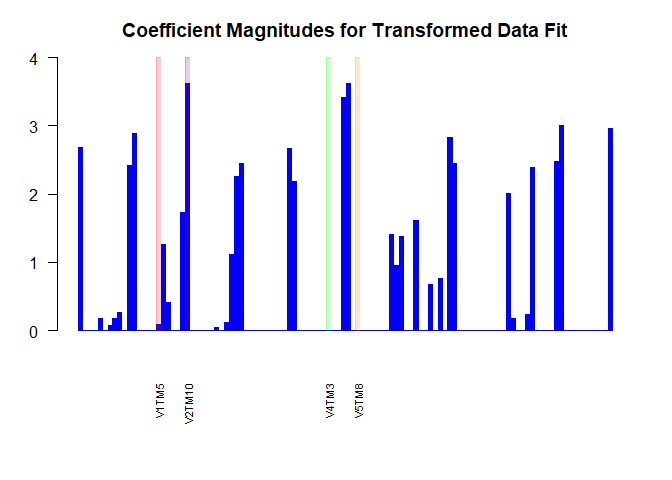<!-- -->

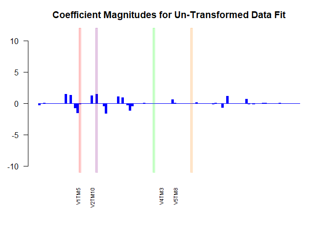<!-- -->

The computational advantage is slightly reduced when the extra versions are
calculated because the size of the new data set is essentially double-plus that
of the old one. However, the increase in performance in terms of the accuracy of
the model when compared to the non-transformed data is arguably worth expending
the small-ish amount of extra computational energy to produce the much better
results. The next plots show the success of the fit against the test set with
the extra versions calculated.  The procedure that was followed, which seems to
yield generally good results, is repeatedly running the algorithm that
calculates the extra versions and fits the model until there are no more false-
positives in the training set, then run the algorithm using the development set
instead of the training set, and then finally run the algorithm on the training
set again until there are no more false-positive results.


```
## Fitting a new model with additional feature versions that *might* exist...
```

```
##   Done.
```
It takes two iterations for this data set to make use of all of the false positive data to clip the critical ranges because the large number of irrelevant variables generates a correspondingly large set of noisy data.  This noisy data makes it much more difficult to distinguish false positive values that are due to coincidental correlations in the irrelevant data and false positive values that are due to multiple independent causes for the same event. To determine the optimal number of zones or combinations of iterations, use the devset as a guide.  When that performance is optimized, the best assumption is that the test set (or real world performance) will be at optimum.

```r
model_1a <- collapse_limits(model_1a, nzones = 3)
```

It is clear from the performance of the new models trained with extra versions
of each feature that would exist if a logical 'OR' relationship existed that
there is a significant performance boost when the new versions of each feature
with different critical ranges are created. The Figures below show the training,
development, and test sets when applied to the model created with the limited
number of extra versions, and the performance advantage over the LASSO applied
to the original continuous data is profound.

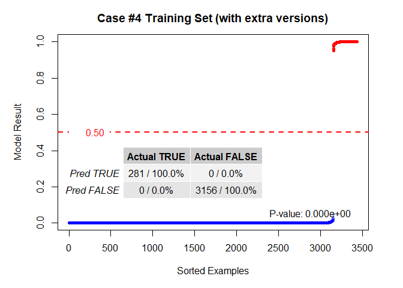<!-- -->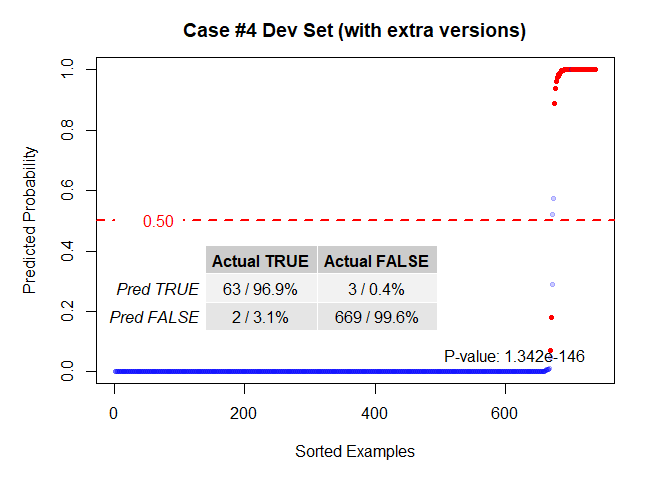<!-- -->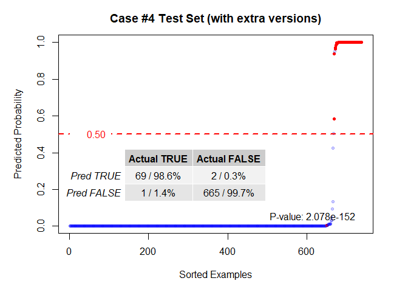<!-- -->

The LASSO results with the unmodified continuous data shown above indicate that
while there is definitely a relationship, it is not very precise and the the
difficulty in creating a model in which multiple features within the same data
set can independently cause the same result is evident. 

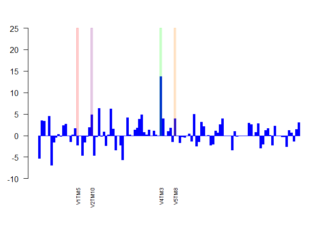<!-- -->

Unlike case 3, this set of coefficients is considerably noisier.  It is worth
pointing out that three of the relevant features and time steps *are* indicated,
but only one is distinguishable from the noise at this point. The success of
this method hinges on whether there is enough information to accurately define
the true critical ranges of the features present, and each additional set of
non-relevant data causes this burden to incrementally rise. As more data is
analyzed, however, the more clear the result will become, allowing a steady
removal of non-relevant features, until only the relevant ones are left.  The
improvements in model performance seem to be evident before any additional
clarity in the analysis of coefficient magnitudes is seen.


```r
# LS just means LASSO
model_3 <- modelfit(data = dset_train, fit_type = "RF", groups = dset_groups)
message("  Done.")
```

```
##   Done.
```

```r
plot(model_3, title = "Case #4 Training Set (Random Forest)",
     data = dset_train, h = 0.5, cx = hpos, ylab = "Predicted Probability")
```

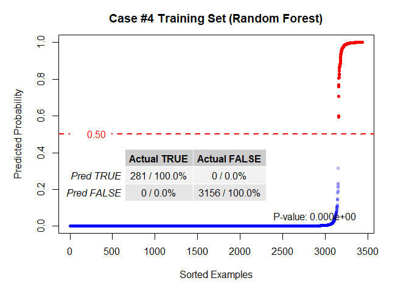<!-- -->

```r
plot(model_3, title = "Case #4 Test Set (Random Forest)",
     data = dset_test, h = 0.5, cx = hpos, ylab = "Predicted Probability")
```

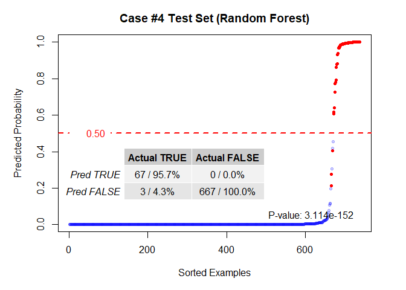<!-- -->

```r
TRANS   <- 0.2
BARHT   <- 0.02
beta3   <- model_3$model$importance[,"%IncMSE"]
markers <- rep(0,length(beta3))
cols    <- rep(rgb(0,0,0,0), length(beta3))

cols[grep("V1TM5", names(beta3))]      <- rgb(1.0, 0.0, 0.0,TRANS) #RED
markers[grep("V1TM5", names(beta3))]   <- BARHT
cols[grep("V2TM10", names(beta3))]     <- rgb(0.5, 0.0, 0.5,TRANS) #PURPLE
markers[grep("V2TM10", names(beta3))]  <- BARHT
cols[grep("V4TM3", names(beta3))]      <- rgb(0.0, 1.0, 0.0,TRANS) #GREEN
markers[grep("V4TM3", names(beta3))]   <- BARHT
cols[grep("V5TM8", names(beta3))]      <- rgb(1.0, 0.5, 0.0,TRANS) #ORANGE
markers[grep("V5TM8", names(beta3))]   <- BARHT

par(new=FALSE, mar = c(6,3,3,2))
barplot(beta3, border = "blue", col = "blue", ylim = c(-0.01, BARHT), las = 2,
        xaxt = "n")

par(new=TRUE)
bplot <- barplot(markers, border = cols, col = cols, ylim = c(-0.01, BARHT),
                 axes = FALSE)
cnames <- c("V1TM5", "V2TM10", "V4TM3", "V5TM8")
bplot_at <- NULL
labs     <- NULL
for (i in 1:length(cnames)) {
  labs <- c(labs, names(beta3)[grep(cnames[i],names(beta3))])
  bplot_at <- c(bplot_at,grep(cnames[i],names(beta3)))
}
bplot_labels <- rep(NA, length(beta3))
bplot_labels[bplot_at] <- labs
axis(1, at = bplot, labels =bplot_labels, las=2, cex.axis=0.7, tick=FALSE)
```

<!-- -->


In this particular case, the Random Forest method did well but it still under-
performed the LASSO on the transformed data set after the critical ranges are
clipped with the false positive data.  In general, the Random Forest method will
do well on problems like this, in many cases marginally out-performing the LASSO
on the transformed data set, but the LASSO will perform on-par after the
critical ranges are clipped with the false positive data.  Additionally, the
LASSO used in this way is considerably less computationally intensive and may
serve better for data sets with large numbers of features.


