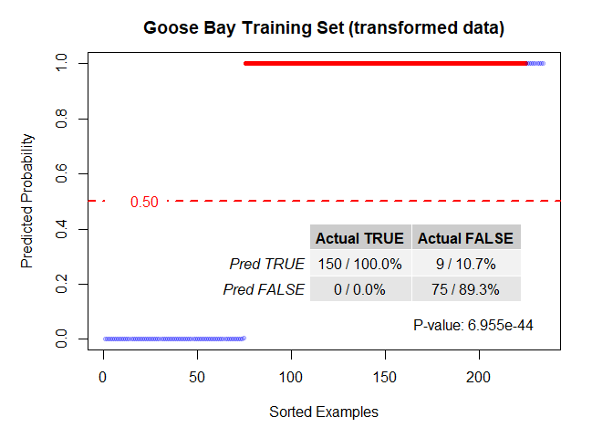
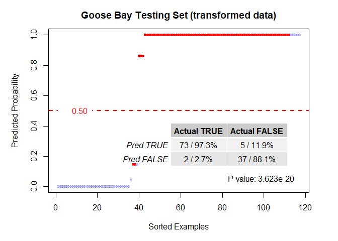
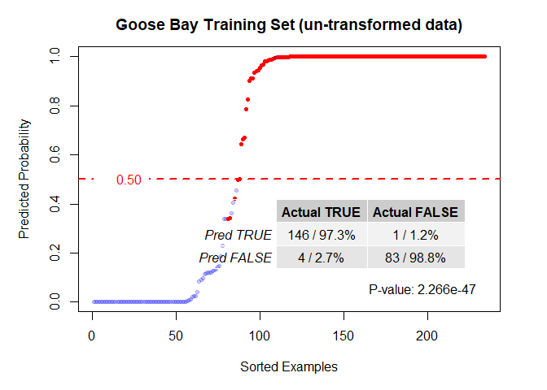
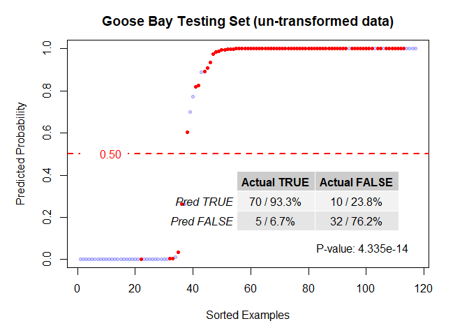
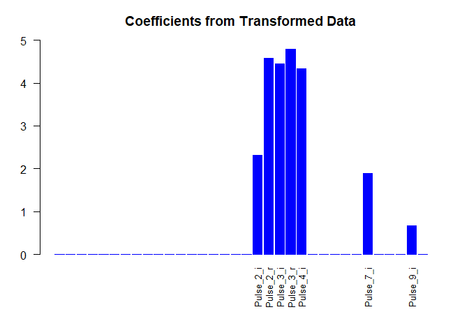
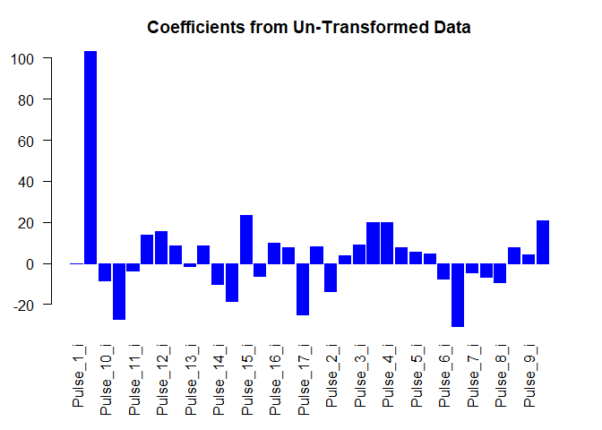

## Introduction

This document was created by running the "Goose_Bay_markdown.Rmd" file in
RStudio. It utilizes the script files "functions.R" and "rectify.R" within the
"Code" directory in this repository, which are used to define the functions that
are called below.  This document reflects real world data, and walks through
the process from reading in the raw data to displaying the plots for
interpretation.

## About the Data

One thoroughly analyzed data set that is often used as an exemplar is the
ionosphere data collected by a system in Goose Bay, Labrador, downloaded from
the UCI data repository (<a href="http://archive.ics.uci.edu/ml/datasets/Ionosphere">UCI Data</a>). The original study was published in 1989 [<a href="https://www.jhuapl.edu/Content/techdigest/pdf/V10-N03/10-03-Sigillito_Class.pdf">33</a>] and has been subsequently used in at least 55 additional papers as a test set
for machine learning algorithms.

From the UCI page [<a href="http://archive.ics.uci.edu/ml/index.php">32</a>]:
"This radar data was collected by a system in Goose Bay, Labrador. This system
consists of a phased array of 16 high-frequency antennas with a total
transmitted power on the order of 6.4 kilowatts. See the paper for more details.
The targets were free electrons in the ionosphere. "Good" radar returns are
those showing evidence of some type of structure in the ionosphere. "Bad"
returns are those that do not; their signals pass through the ionosphere.

Received signals were processed using an autocorrelation function whose
arguments are the time of a pulse and the pulse number. There were 17 pulse
numbers for the Goose Bay system. Instances in this databse are described by 2
attributes per pulse number, corresponding to the complex values returned by the
function resulting from the complex electromagnetic signal."


```
## Reading in the data file...
```

```
##   Done.
```

```
## Splitting the data...
```

```
##   Done.
```

```
## Transforming the data...
```

```
##   Done.
```

## Studying the Goose Bay Data


```
## Fitting Models...
```

```
## Warning: package 'rlang' was built under R version 4.2.1
```

```
## Loaded glmnet 4.1-4
```

```
## Loading required package: openssl
```

```
## Warning: package 'openssl' was built under R version 4.2.1
```

```
## Linking to: OpenSSL 1.1.1k  25 Mar 2021
```

```
##   Done.
```
The LASSO with transformed data (shown immediately below) again exceeded the
performance the LASSO with the original un-transformed data (shown below the
figures for the transformed data) and nearly matched the neural network that was
specifically tuned and used to analyze the data in the original paper.


```
## 
## Attaching package: 'gridExtra'
```

```
## The following object is masked from 'package:dplyr':
## 
##     combine
```

<!-- --><!-- -->

<!-- --><!-- -->

Additionally, a sparse coefficient vector was returned (shown below), which
clearly indicates which signals are important, along with the critical ranges of
the important signals, which are arguably nearly as interesting as the model
results alone.

<!-- -->

The coefficient for the LASSO solution on the un-transformed data (see below),
by contrast, shows no clear feature attribution.  The largest coefficient, in
fact, seems to be one which as no clear connection to the solution at all.

<!-- -->

