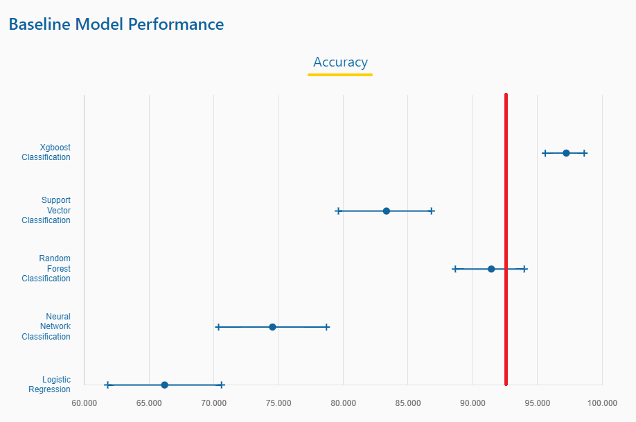
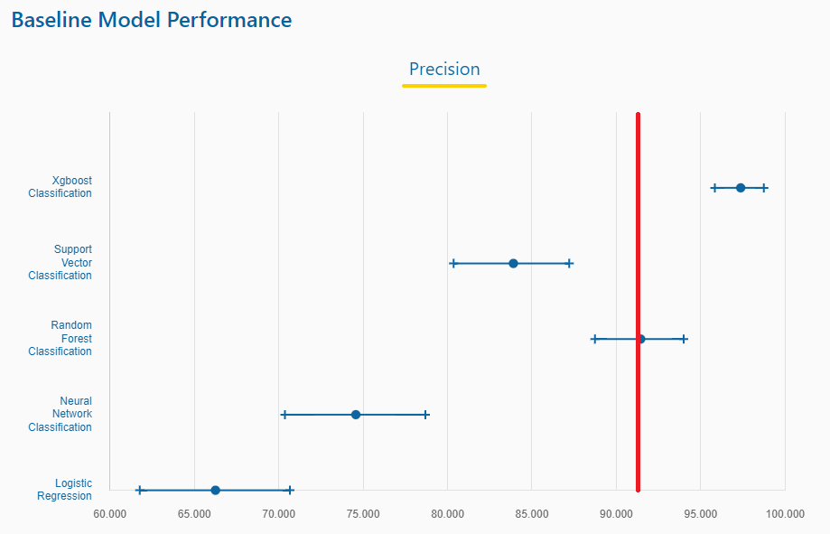

```{r setup, include=FALSE}
knitr::opts_chunk$set(echo = TRUE)
library(readr, quietly = TRUE)

setwd("~/lle/Cases/MONKS")

source("../../Code/functions.R")
source("../../Code/rectify.R")
source("../../Code/collapse_limits.R")
```

## The MONK's Problems as a venerable Machine Learning Test Set

From the <a href = "https://archive.ics.uci.edu/ml/datasets/MONK%27s+Problems"> UCI Machine Learning Repository</a>:
"The MONK's problems were the basis of a first international comparison of learning algorithms. The result of this comparison is summarized in "The MONK's Problems - A Performance Comparison of Different Learning algorithms" by S.B. Thrun, J. Bala, E. Bloedorn, I. Bratko, B. Cestnik, J. Cheng, K. De Jong, S. Dzeroski, S.E. Fahlman, D. Fisher, R. Hamann, K. Kaufman, S. Keller, I. Kononenko, J. Kreuziger, R.S. Michalski, T. Mitchell, P. Pachowicz, Y. Reich H. Vafaie, W. Van de Welde, W. Wenzel, J. Wnek, and J. Zhang has been published as Technical Report CS-CMU-91-197, Carnegie Mellon University in Dec. 1991.

One significant characteristic of this comparison is that it was performed by a collection of researchers, each of whom was an advocate of the technique they tested (often they were the creators of the various methods). In this sense, the results are less biased than in comparisons performed by a single person advocating a specific learning method, and more accurately reflect the generalization behavior of the learning techniques as applied by knowledgeable users.

There are three MONK's problems. The domains for all MONK's problems are the same (described below). One of the MONK's problems has noise added. For each problem, the domain has been partitioned into a train and test set."

The following formulae describe how the data for the Monks Problem Set was
constructed:

MONK-1: (attribute_1 = attribute_2) or (attribute_5 = 1)

MONK-2: (attribute_n = 1) for EXACTLY TWO choices of n (in {1,2,...,6})

MONK-3: (attribute_5  = 3 and attribute_4  = 1) or
        (attribute_5 != 4 and attribute_2 != 3)
              
As expected, the transformation process combined with the LASSO algorithm (and
including other algorithm types) are reasonably good at solving these types of
problems.

The following code and plots show how well the rectification procedure works on
data like this.

### MONK-1

(attribute_1 = attribute_2) or (attribute_5 = 1)

The column differences were included in this fit, and for small data sets like
this, it is likely something that should always be done since there is no real
down side.

The plots show that both LASSO and the decision tree model (Random Forest) on
the un-transformed data perform poorly in comparison to the perfect
classification of the transformed data.  The bar plot following also shows the
perfect attribution and feature selection.

By taking note of which categories correspond to which column, we can mark those
on the feature attribution bar plot and determine how well they correspond to
the "correct" answer.

```{r}
monks_1_train <- read_table("monks-1_train.csv", col_names = FALSE, show_col_types = FALSE)
colnames(monks_1_train) <- c("INDC", "a1", "a2","a3","a4","a5","a6","ID")
monks_1_train$INDC <- as.logical(monks_1_train$INDC)

monks_1_test <- read_table("monks-1_test.csv", col_names = FALSE, show_col_types = FALSE)
colnames(monks_1_test) <- c("INDC", "a1", "a2","a3","a4","a5","a6","ID")
monks_1_test$INDC <- as.logical(monks_1_test$INDC)

# adding an index column
monks_1_train$X <- 1:dim(monks_1_train)[1]
monks_1_test$X  <- 1:dim(monks_1_test)[1]
# ensuring the result is just a normal data frame
monks_1_train <- data.frame(monks_1_train)
monks_1_test  <- data.frame(monks_1_test)

# fitting the models
monks_model1_SQ <- modelfit(data = monks_1_train, exclude = c("ID","X"),
                            groups = list(group1 = c("a1", "a2","a3","a4","a5","a6")),
                            params = list(diffs=TRUE,
                                          cdata=c("a1", "a2","a3","a4","a5","a6")))

print(monks_model1_SQ$model$lcats[1:3])
```
Printing the first few categories reveals that "a5.4" is the column that
corresponds with the "(attribute_5 = 1)".  The nomenclature of the difference
columns dictates that the first part of the column name is "a1_D_a2", the
column that corresponds to a difference of 0 (when the attributes are equal) is:

```{r}
print(monks_model1_SQ$model$lcats[10:12])
```
So, columns "a5.4" and "a1_D_a2.1" correspond to the relevant variables to look
out for.

```{r}
monks_model1_LS <- modelfit(data = monks_1_train, exclude = c("ID","X"),
                            groups = list(group1 = c("a1", "a2","a3","a4","a5","a6")),
                            fit_type = "LS")

monks_model1_RF <- modelfit(data = monks_1_train, exclude = c("ID","X"), 
                            groups = list(group1 = c("a1", "a2","a3","a4","a5","a6")),
                            fit_type = "RF")

plot(monks_model1_SQ, title = "Monks 1 Training Data (Transformed)")
plot(monks_model1_SQ, data = monks_1_test, title = "Monks 1 Testing Data (Transformed)")
plot(monks_model1_LS, data = monks_1_test, title = "Monks 1 Testing Data (LASSO, un-Transformed)",cx=.7)
plot(monks_model1_RF, data = monks_1_test, title = "Monks 1 Testing Data (RF, un-Transformed)",cx=.7)

beta1 <- monks_model1_SQ$model$beta[,]
par(new=FALSE, mar = c(6,5,3,2))
bplot <- barplot(beta1, main = "Feature Attribution for LASSO with Transformed Data", xlab = "Feature", ylab = "Coefficient Value", col = "blue", xaxt = "n",
        las = 2)
#print(bplot)
cnames <- c("a5.4", "a1_D_a2.1")
bplot_at <- NULL
for (i in 1:length(cnames))
  bplot_at <- c(bplot_at,grep(paste0("^",cnames[i],"$"),names(beta1)))
bplot_labels <- rep(NA, length(beta1))
bplot_labels[bplot_at] <- cnames
axis(1, at = bplot, labels =bplot_labels, las=2, cex.axis=0.7, tick=FALSE)

```

The plot shows that the location of the bars agrees perfectly with the location
of the relevant feature labels.

### MONK-2

(attribute_n = 1) for EXACTLY TWO choices of n (in {1,2,...,6})

While the results from the second problem are not nearly as good as the previous
showcased results, they still marginally outperform the decision tree model (Random Forest) and vastly outperform the LASSO on the untransformed data.

The relevant features in this case could be any of the attributes as long as
they meet the requirements.  The fact that it outperforms the decision tree
model in this case, even by a marginal amount, is surprising.

```{r}
monks_2_train <- read_table("monks-2_train.csv", col_names = FALSE, show_col_types = FALSE)
colnames(monks_2_train) <- c("INDC", "a1", "a2","a3","a4","a5","a6","ID")
monks_2_train$INDC <- as.logical(monks_2_train$INDC)

monks_2_test <- read_table("monks-2_test.csv", col_names = FALSE, show_col_types = FALSE)
colnames(monks_2_test) <- c("INDC", "a1", "a2","a3","a4","a5","a6","ID")
monks_2_test$INDC <- as.logical(monks_2_test$INDC)

# fuzzing the results
# set.seed(1234)
# for (i in 1:6) {
#   monks_2_train[,i+1] <- monks_2_train[,i+1] + runif(dim(monks_2_train)[1])*0.5 - 0.25
#   monks_2_test[,i+1]  <- monks_2_test[,i+1]  + runif(dim(monks_2_test)[1])*0.5 - 0.25
# }
# adding an index column
monks_2_train$X <- 1:dim(monks_2_train)[1]
monks_2_test$X  <- 1:dim(monks_2_test)[1]
# ensuring the result is just a normal data frame
monks_2_train <- data.frame(monks_2_train)
monks_2_test  <- data.frame(monks_2_test)

monks_model2_SQ <- modelfit(data = monks_2_train, exclude = c("ID","X"),
                        groups = list(group1 = c("a1", "a2","a3","a4","a5","a6")),
                        params = list(diffs=TRUE,
                                      cdata=c("a1", "a2","a3","a4","a5","a6")))
monks_model2_LS <- modelfit(data = monks_2_train, exclude = c("ID","X"),
                            groups = list(group1 = c("a1", "a2","a3","a4","a5","a6")),
                            fit_type = "LS")

monks_model2_RF <- modelfit(data = monks_2_train, exclude = c("ID","X"), 
                            groups = list(group1 = c("a1", "a2","a3","a4","a5","a6")),
                            fit_type = "RF")

plot(monks_model2_SQ, title = "Monks 2 Training Data (Transformed)")
plot(monks_model2_SQ, data = monks_2_test, title = "Monks 2 Testing Data (Transformed)")
plot(monks_model2_LS, data = monks_2_test, title = "Monks 2 Testing Data (LASSO, un-Transformed)",cx=.7)
plot(monks_model2_RF, data = monks_2_test, title = "Monks 2 Testing Data (RF, un-Transformed)",cx=.7)

beta2 <- monks_model2_SQ$model$beta[,]
par(new=FALSE, mar = c(6,5,3,2))
bplot <- barplot(beta2, main = "Feature Attribution for LASSO with Transformed Data", xlab = "Feature", ylab = "Coefficient Value", col = "blue", xaxt = "n",
        las = 2)
#print(bplot)
# cnames <- c("a5.4", "a1_D_a2.1")
# bplot_at <- NULL
# for (i in 1:length(cnames))
#   bplot_at <- c(bplot_at,grep(paste0("^",cnames[i],"$"),names(beta1)))
# bplot_labels <- rep(NA, length(beta1))
# bplot_labels[bplot_at] <- cnames
# axis(1, at = bplot, labels =bplot_labels, las=2, cex.axis=0.7, tick=FALSE)

```

The barplot seemingly does not convey any useful information, though since the
"relevant" features could be any of the features, this is not surprising.

### MONK-3

(attribute_5  = 3 and attribute_4  = 1) or
(attribute_5 != 4 and attribute_2 != 3)

```{r}

monks_3_train <- read_table("monks-3_train.csv", col_names = FALSE, show_col_types = FALSE)
colnames(monks_3_train) <- c("INDC", "a1", "a2","a3","a4","a5","a6","ID")
monks_3_train$INDC <- as.logical(monks_3_train$INDC)

monks_3_test <- read_table("monks-3_test.csv", col_names = FALSE, show_col_types = FALSE)
colnames(monks_3_test) <- c("INDC", "a1", "a2","a3","a4","a5","a6","ID")
monks_3_test$INDC <- as.logical(monks_3_test$INDC)

# adding an index column
monks_3_train$X <- 1:dim(monks_3_train)[1]
monks_3_test$X  <- 1:dim(monks_3_test)[1]
# ensuring the result is just a normal data frame
monks_3_train <- data.frame(monks_3_train)
monks_3_test  <- data.frame(monks_3_test)

monks_model3_SQ <- modelfit(data = monks_3_train, exclude = c("ID","X"),
                        groups = list(group1 = c("a1", "a2","a3","a4","a5","a6")),
                        params = list(diffs=FALSE,
                                      cdata=c("a1", "a2","a3","a4","a5","a6")))

print(monks_model3_SQ$model$lcats[1:5])
```

```{r}
monks_model3_LS <- modelfit(data = monks_3_train, exclude = c("ID","X"),
                            groups = list(group1 = c("a1", "a2","a3","a4","a5","a6")),
                            fit_type = "LS")

monks_model3_RF <- modelfit(data = monks_3_train, exclude = c("ID","X"), 
                            groups = list(group1 = c("a1", "a2","a3","a4","a5","a6")),
                            fit_type = "RF")

plot(monks_model3_SQ, title = "Monks 3 Training Data (Transformed)")
plot(monks_model3_SQ, data = monks_3_test, title = "Monks 3 Testing Data (Transformed)", cx=.8,cy=.4)
plot(monks_model3_LS, data = monks_3_test, title = "Monks 3 Testing Data (LASSO, un-Transformed)", cx=.5)
plot(monks_model3_RF, data = monks_3_test, title = "Monks 3 Testing Data (RF, un-Transformed)", cx=.5)

beta3 <- monks_model3_SQ$model$beta[,]
par(new=FALSE, mar = c(6,5,3,2))
bplot <- barplot(beta3, main = "Feature Attribution for LASSO with Transformed Data", xlab = "Feature", ylab = "Coefficient Value", col = "blue", xaxt = "n",
        las = 2)
cnames <- c("a5.3", "a5.4", "a4.1", "a2.3")
bplot_at <- NULL
for (i in 1:length(cnames))
  bplot_at <- c(bplot_at,grep(paste0("^",cnames[i],"$"),names(beta3)))
bplot_labels <- rep(NA, length(beta3))
bplot_labels[bplot_at] <- cnames
axis(1, at = bplot, labels =bplot_labels, las=2, cex.axis=0.7, tick=FALSE)

```

Based on this plot, the feature space was still relatively sparse, but the
attribution is not quite as clear.  Three out of the four relevant features were
indicated, but only two were actually clear.

### Performance Comparisons

The MONK problems have been compared on many machine learning platforms with
many different algorithms, from the <a href="https://archive-beta.ics.uci.edu/dataset/70/monk+s+problems">UCI Machine Learning Repository</a>, the
the following plots show the expected accuracy and precision:





#### Transformed Data Comparison

Accuracy using transformed data:
A = (216+204+107+238+216+216)/(216+12+204+107+35+238+52+216+216) = **0.9236**

Precision using transformed data:
P = (216+107+216)/(216+107+216+52) = **0.9120**

From these published ranges, the LASSO with transformed data can be seen to
function on par with Random Forest, but the added benefit in problems #1 and
#3 is the sparse feature set and the ability to attribute cause to effect.

#### Citations

The following is the requested citation for these problems:

MONK's Problems. (1992). UCI Machine Learning Repository.

##### *Notable papers*:

Wnek, J., "Hypothesis-driven Constructive Induction," PhD dissertation, School of Information Technology and Engineering, Reports of Machine Learning and Inference Laboratory, MLI 93-2, Center for Artificial Intelligence, George Mason University, March 1993.

Wnek, J. and Michalski, R.S., "Comparing Symbolic and Subsymbolic Learning: Three Studies," in Machine Learning: A Multistrategy Approach, Vol. 4., R.S. Michalski and G. Tecuci (Eds.), Morgan Kaufmann, San Mateo, CA, 1993.


