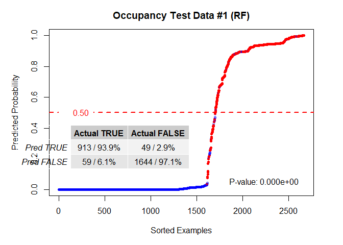
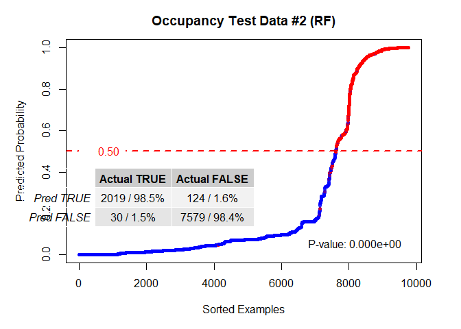
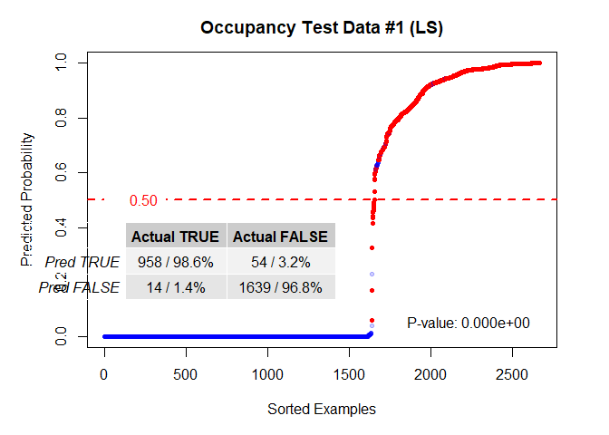
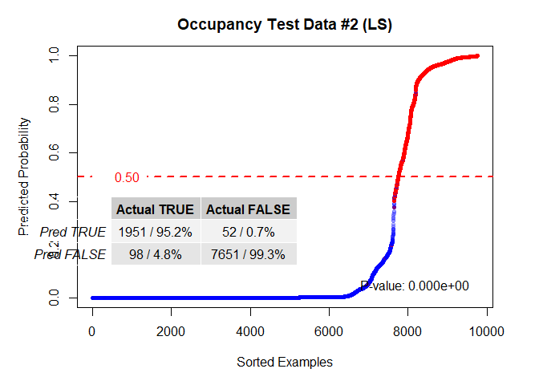
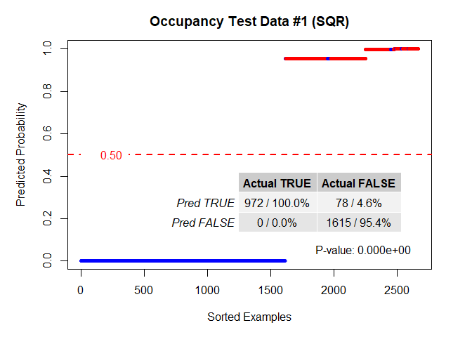
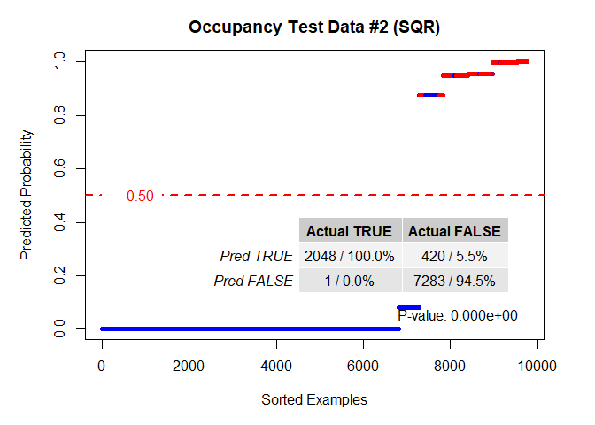
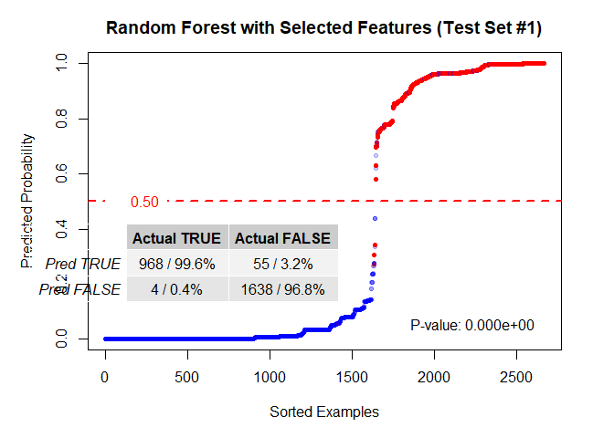

## Detecting Occupancy

In 2015, Luis Candanedo and Véronique Feldheim published a <a href="https://www.researchgate.net/profile/Luis_Candanedo_Ibarra/publication/285627413_Accurate_occupancy_detection_of_an_office_room_from_light_temperature_humidity_and_CO2_measurements_using_statistical_learning_models/links/5b1d843ea6fdcca67b690c28/Accurate-occupancy-detection-of-an-office-room-from-light-temperature-humidity-and-CO2-measurements-using-statistical-learning-models.pdf">paper</a> and a data set intended
to demonstrate a highly accurate system for the detection of human occupancy in
a room based on light, humidity, CO2 concentration, and temperature. One of the
stated difficulties in modeling this set was a high degree of correlation
between the parameters, which makes it an excellent test for this method of
analysis.  What we find is that when the results of methods studied by the paper
are examined with the LASSO model run on the transformed data for the same
features, the transformed data performs on par with the standards published in
the paper.  The advantage comes when computational power and feature selection
are considered. A relatively difficult combination of features (Light, CO2,
Humidity, Humidity Ratio, and Week Status) was chosen to compare numbers that
were not all clustered around 100%.  The following are the results:

 Method   | Accuracy(paper) | Accuracy (this) | Enhanced |
:--------:|:---------------:|:---------------:|:--------:|
LASSO(Tr) |95.8%            |97.0%            |N/A       |
RF        |96.06%           |94.05%*          |97.6%     |
GBM       |96.06%           |N/A              |N/A       |
CART      |97.82%           |N/A              |N/A       |
LDA       |97.86%           |N/A              |N/A       |
* It is unclear where the authors of the other paper drew the discrimination
threshold, but all thresholds are drawn at 0.5 in this work for the purpose of
comparison on a level playing field.

The "Enhanced" column above shows the Random Forest model when the features 
selected via the LASSO with transformed data are used.  This shows a 3.5%+ boost
in accuracy when modeled using the features selected when this is the only
change, and is an example of how the two techniques could be used together.


```
## Loading required package: rlang
```

```
## Warning: package 'rlang' was built under R version 4.2.1
```

```
## Loading required package: gglasso
```

```
## Warning: package 'gglasso' was built under R version 4.2.1
```

```
## Loading required package: randomForest
```

```
## Warning: package 'randomForest' was built under R version 4.2.1
```

```
## randomForest 4.7-1.1
```

```
## Type rfNews() to see new features/changes/bug fixes.
```

```
## Loading required package: openssl
```

```
## Warning: package 'openssl' was built under R version 4.2.1
```

```
## Linking to: OpenSSL 1.1.1k  25 Mar 2021
```


```
## 
## Attaching package: 'dplyr'
```

```
## The following object is masked from 'package:randomForest':
## 
##     combine
```

```
## The following objects are masked from 'package:stats':
## 
##     filter, lag
```

```
## The following objects are masked from 'package:base':
## 
##     intersect, setdiff, setequal, union
```

```
## 
## Attaching package: 'gridExtra'
```

```
## The following object is masked from 'package:dplyr':
## 
##     combine
```

```
## The following object is masked from 'package:randomForest':
## 
##     combine
```

<!-- --><!-- -->

```
## Loaded glmnet 4.1-4
```

<!-- --><!-- --><!-- --><!-- --><!-- -->


The weekdays listed are:  wday.1 = Wed, wday.2 = Thurs, wday.3 = Fri,
wday.4 = Sat, wday.5 = Sun, wday.6 = Mon, wday.7 = Tues.  So, the plot above
shows that negative coefficients were assigned to Saturday and Sunday.  They
ended up in this order because that is the order that they appeared in the
original data file.

<!-- -->


Note that while the true negative numbers were slightly less for the LASSO on
transformed data (SQR), the true positive numbers were 100.0% for both test sets.
Under certain circumstances this would be a superior result if the cost were
higher to miss an occupied office than to falsely presume that an unoccupied
office is occupied (for after hours surveillance, for instance). The returns are
also much more definitive than either the random forest or LASSO on un-
Transformed data solutions.

The real value comes when investigating the feature selection, however.  The
LASSO feature selection on the un-Transformed data seems to consist almost
entirely of the temperature sensor returns.  While there is some merit to using
this feature, the less accurate returns and more ambiguous transition from
negative to positive examples signal that this is not a very good selection.
The selection made by the LASSO on the transformed data seems to not only work
better, it makes some intuitive sense.  Saturdays and Sundays and excluded
(large negative coefficients) and the light and CO2 sensors are utilized almost
entirely.  The efficacy of this choice is clear when only these features are
extracted and then a random forest fit is performed on the selected data.  The
new random forest model results in a 3.5%+ bump in accuracy and shows a much
better defined transition between negative and positive examples.


<!-- --><!-- -->

In conclusion, there is a great deal of merit to using the models produced by
the LASSO on the transformed data, but the clarity in the feature selection
promises an even more fruitful cooperative effort between different modeling
techniques.


